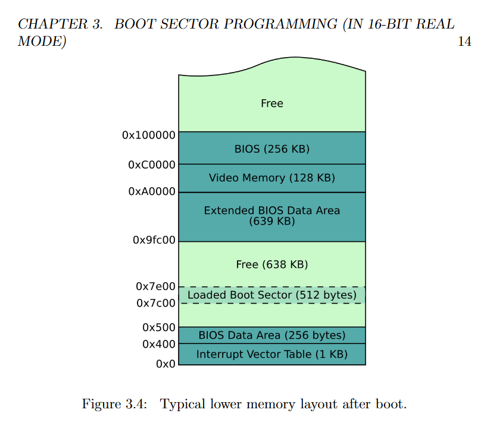

# ZOS

Learning Operating System Development

## Qemu and Nasm Install

### Compile from Source Code

```shell
sudo apt install build-essential zlib1g-dev pkg-config libglib2.0-dev binutils-dev libboost-all-dev autoconf libtool libssl-dev libpixman-1-dev virtualenv
wget https://download.qemu.org/qemu-4.2.0.tar.xz
tar xvJf qemu-4.2.0.tar.xz
cd qemu-4.2.0
./configure
make -j4
sudo make install
```

### Install by apt

```shell
sudo apt install qemu nasm -y
```

## VNC

- [RealVNC](https://www.realvnc.com) GTK UI
- [Teamviewer](https://www.teamviewer.com) QT UI

## Source Code and Command Line List

### 1. [boot.asm](boot.asm)

> The BIOS checks that bytes 511 and 512 of the alleged boot sector are bytes 0xAA55.

```assembly
; Infinite loop (e9 fd ff)
loop:
    jmp loop

; Fill with 510 zeros minus the size of the previous code
times 510-($-$$) db 0
; Magic number
dw 0xaa55
```

> **Compile and Run**

```shell
nasm -f bin boot.asm -o boot.bin
# curses ui
qemu-system-x86_64 boot.bin --nographic and/or --curses
# VNC Server
qemu-system-x86_64 boot.bin
# VNC server running on 127.0.0.1:5900
```

### 2. [hello.asm](hello.asm)

```assembly
mov ah, 0x0e ; tty mode
mov al, 'H' ; write character
int 0x10  ; interrupt for video services
```

### 3. [memory.asm](memory.asm)

[Writing a Simple Operating System —from Scratch pdf](https://www.cs.bham.ac.uk/~exr/lectures/opsys/10_11/lectures/os-dev.pdf) page 14



```shell
xxd memory.bin
```

```assembly
mov ah, 0x0e
; attempt 3
; Add the BIOS starting offset 0x7c00 to the memory address of the X
; and then dereference the contents of that pointer.
; We need the help of a different register 'bx' because 'mov al, [ax]' is illegal.
; A register can't be used as source and destination for the same command.
mov al, "3"
int 0x10
mov bx, the_secret
add bx, 0x7c00
mov al, [bx]
int 0x1
```

### 4. [memory_org.asm](memory_org.asm)

```assembly
[org 0x7c00]
mov ah, 0x0e

; attempt 2
; Having solved the memory offset problem with 'org', this is now the correct answer
mov al, "2"
int 0x10
mov al, [the_secret]
int 0x105
```

### 5. [stack.asm](stack.asm)


### 6. [Functions](functions)

- [main.asm](functions/main.asm)

```assembly
mov bx, HELLO
call print
```

- [print.asm](functions/print.asm)

```assembly
pusha
; ...
cmp al, 0
je done
; ...
jmp start
; ...
popa
ret
```

- [print.asm](functions/print_hex.asm)

```assembly
; ...
and ax, 0x000f ; 0x1234 -> 0x0004 by masking first three to zeros
add al, 0x30 ; add 0x30 to N to convert it to ASCII "N
; ...
jle step2
; ...
ror dx, 4 ; Rotate Right Operation
; ...
HEX_OUT:
    db '0x0000',0
```

- ASCII Table

```text
  Dec Hex      Dec Hex     Dec Hex    Dec Hex    Dec Hex    Dec Hex    Dec Hex    Dec Hex
  0   00  NUL  16  10 DLE  32  20     48  30  0  64  40  @  80  50  P   96 60  `  112 70  p
  1   01  SOH  17  11 DC1  33  21  !  49  31  1  65  41  A  81  51  Q   97 61  a  113 71  q
  2   02  STX  18  12 DC2  34  22  "  50  32  2  66  42  B  82  52  R   98 62  b  114 72  r
  3   03  ETX  19  13 DC3  35  23  #  51  33  3  67  43  C  83  53  S   99 63  c  115 73  s
  4   04  EOT  20  14 DC4  36  24  $  52  34  4  68  44  D  84  54  T  100 64  d  116 74  t
  5   05  ENQ  21  15 NAK  37  25  %  53  35  5  69  45  E  85  55  U  101 65  e  117 75  u
  6   06  ACK  22  16 SYN  38  26  &  54  36  6  70  46  F  86  56  V  102 66  f  118 76  v
  7   07  BEL  23  17 ETB  39  27  '  55  37  7  71  47  G  87  57  W  103 67  g  119 77  w
  8   08  BS   24  18 CAN  40  28  (  56  38  8  72  48  H  88  58  X  104 68  h  120 78  x
  9   09  HT   25  19 EM   41  29  )  57  39  9  73  49  I  89  59  Y  105 69  i  121 79  y
 10   0A  LF   26  1A SUB  42  2A  *  58  3A  :  74  4A  J  90  5A  Z  106 6A  j  122 7A  z
 11   0B  VT   27  1B ESC  43  2B  +  59  3B  ;  75  4B  K  91  5B  [  107 6B  k  123 7B  {
 12   0C  FF   28  1C FS   44  2C  ,  60  3C  <  76  4C  L  92  5C  \  108 6C  l  124 7C  |
 13   0D  CR   29  1D GS   45  2D  -  61  3D  =  77  4D  M  93  5D  ]  109 6D  m  125 7D  }
 14   0E  SO   30  1E RS   46  2E  .  62  3E  >  78  4E  N  94  5E  ^  110 6E  n  126 7E  ~
 15   0F  SI   31  1F US   47  2F  /  63  3F  ?  79  4F  O  95  5F  _  111 6F  o  127 7F  DEL
```
