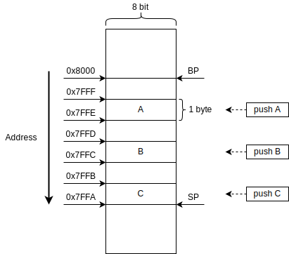

# ZOS

Learning Operating System Development

## Qemu and Nasm Install

### Compile from Source Code

```shell
sudo apt install build-essential zlib1g-dev pkg-config libglib2.0-dev binutils-dev libboost-all-dev autoconf libtool libssl-dev libpixman-1-dev virtualenv
wget https://download.qemu.org/qemu-4.2.0.tar.xz
tar xvJf qemu-4.2.0.tar.xz
cd qemu-4.2.0
./configure
make -j4
sudo make install
```

### Install by apt

```shell
sudo apt install qemu nasm -y
```

## VNC

- [RealVNC](https://www.realvnc.com) GTK UI
- [Teamviewr](https://www.teamviewer.com) QT UI

## Source Code and Command Line List

### 1. [boot.asm](boot.asm)

> The BIOS checks that bytes 511 and 512 of the alleged boot sector are bytes 0xAA55.

```assembly
; Infinite loop (e9 fd ff)
loop:
    jmp loop 

; Fill with 510 zeros minus the size of the previous code
times 510-($-$$) db 0
; Magic number
dw 0xaa55
```

> **Comiple and Run**

```shell
nasm -f bin boot.asm -o boot.bin
# curses ui
qemu-system-x86_64 boot.bin --nographic and/or --curses
# VNC Server
qemu-system-x86_64 boot.bin
# VNC server running on 127.0.0.1:5900
```

### 2. [hello.asm](hello.asm)

```assembly
mov ah, 0x0e ; tty mode
mov al, 'H' ; write character
int 0x10  ; interrupt for video services
```

### 3. [memory.asm](memory.asm)

[Writing a Simple Operating System —from Scratch pdf](https://www.cs.bham.ac.uk/~exr/lectures/opsys/10_11/lectures/os-dev.pdf) page 14


```shell
xxd memory.bin
```

```assembly
mov ah, 0x0e
; attempt 3
; Add the BIOS starting offset 0x7c00 to the memory address of the X
; and then dereference the contents of that pointer.
; We need the help of a different register 'bx' because 'mov al, [ax]' is illegal.
; A register can't be used as source and destination for the same command.
mov al, "3"
int 0x10
mov bx, the_secret
add bx, 0x7c00
mov al, [bx]
int 0x1
```

### 4. [memory_org.asm](memory_org.asm)

```assembly
[org 0x7c00]
mov ah, 0x0e

; attempt 2
; Having solved the memory offset problem with 'org', this is now the correct answer
mov al, "2"
int 0x10
mov al, [the_secret]
int 0x105
```

### 5. [stack.asm](stack.asm)


